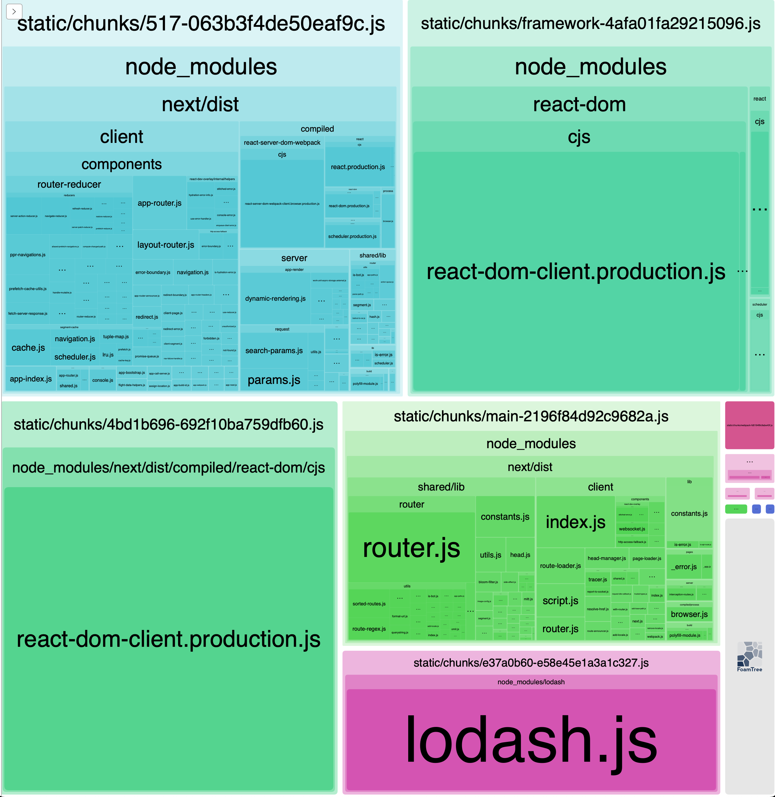

Install `node_modules` with `bun i`, then run `bun run analyze` to create a production build and open the bundle analyzer.

You'll notice that if only the `Count` type is imported by `Counter`, the `lodash` DOES NOT make it into the client bundle.

However, if `const INITIAL_COUNT = 0` is imported by `Counter`, `lodash` DOES make it into the client bundle (even though the client doesn't depend on `lodash`).

